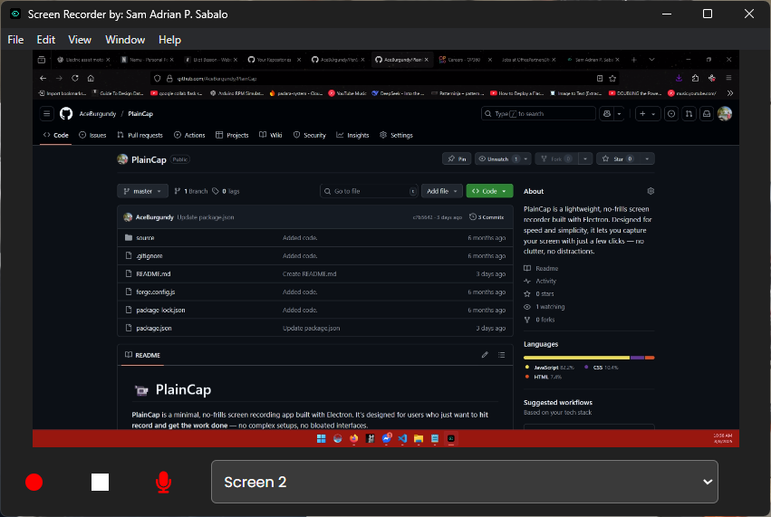

# 📹 PlainCap

**PlainCap** is a minimal, no-frills screen recording app built with Electron. It’s designed for users who just want to **hit record and get the work done** — no complex setups, no bloated interfaces.

---

## 🚀 Features

* 🎥 Simple screen recording (entire screen or window)
* 🔊 System audio and microphone input (if available)
* 💾 Quick saving to `.webm` format
* 🧼 Clean, distraction-free UI
* ⚡️ Lightweight and fast — built on Electron
* 🛠️ Cross-platform (Windows, macOS, Linux)

---

## 🖥️ Screenshot



---

## 🛠 Installation

### Option 1: Prebuilt binaries (Coming soon)

> You’ll be able to download builds for Windows, macOS, and Linux from the [Releases](#) page.

### Option 2: Run from source

```bash
git clone https://github.com/yourusername/plaincap.git
cd plaincap
npm install
npm start
```

---

## 📁 Output

Recordings are saved automatically to your system's **Videos** folder (or a user-defined path, if configured), in `.webm` format.

---

## 🧩 Tech Stack

* [Electron](https://electronjs.org/)
* JavaScript / Node.js
* Native MediaRecorder APIs

---

## 📝 Usage

1. Launch the app.
2. Choose your screen/window to capture.
3. Click **Start Recording**.
4. When you're done, click **Stop**.
5. Your video will be saved automatically.

That's it. No fuss.

---

## 🧳 Use Case Examples

* Quick demo recordings
* Bug reporting with video
* Simple tutorial capture
* Clean screen recordings for developers and testers

---

## 🛡️ Disclaimer

PlainCap is a simple utility tool and does not support advanced features like video editing, trimming, or cloud uploads. It’s intentionally **minimal**.

---

## 📄 License

MIT License

---

## 🙌 Contributions

Contributions are welcome! If you'd like to help improve PlainCap, feel free to fork the repo and submit a pull request.

---

Let me know if you'd like a version that includes instructions for packaging the Electron app, or an extended version with GIF demos.
